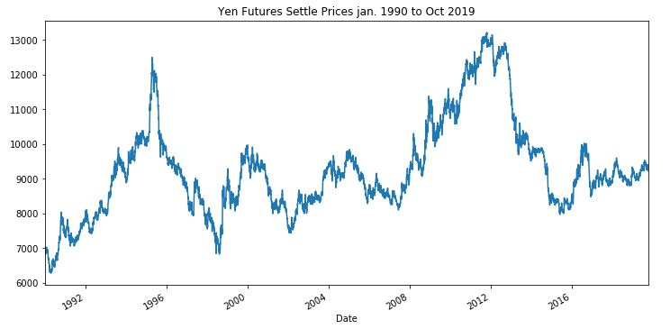
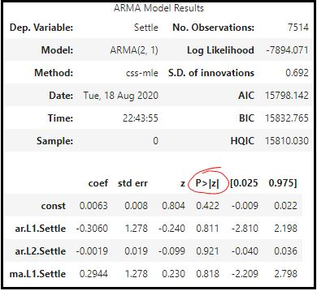
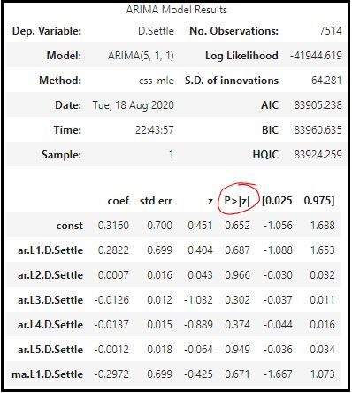
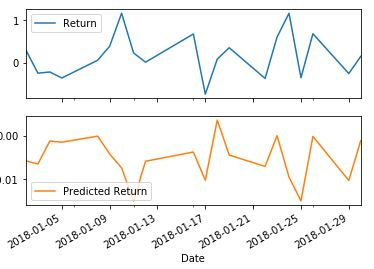

### Yen Futures Analysis Summary and Findings

#### Time-Series Analysis
##### Initial Raw Data Review
After a review of the raw settle data from 1990 to 2019, I can see a period of strong uptrend from 1990 to 1996 followed by a downtrend into consolidation until late 2007.  In 2008 there was the beginning of another strong uptrend until ~2013 where there was another strong downtend into what looks like another consolidation period. During each of the different periods there looked to be opportunites to add to a long-term position or enter into a short-term trade on during a pullback. This is seem in the plot below.

##### ARMA and ARIMA Model Summary
After a review of the ARMA and ARIMA models neither are a good fit due to the p-values being well above the target of 0.05.  This is shown in the model summary reports below.

 

##### Time-Series Analysis Conclustion
Based on the the model evaluation I would not feel confidennt using these models for trading. The GARCH model 5 day forecast is showing an increase in volatility which in turn should correlate to an increase in risk.  At this time I would not buy the yen.  I would continue to work on the models to see if I can find a better fit and I would wait for one of the following:

1. A pullback to around the 9000 level. This level has shown to be a significate level of support and resistance when viewing the raw Settle data from 1990 to 2019.

2. A break of the 9800 to 10000 level.  This level has also shown to be a historical support and resistance level.  Most important is that it was a heavy resistant point during the consolidation period from around 1999 to 2009.

#### Regression Analysis
Based on the plot shown below the Linear Regresson model became better at predicting the direction of the returns around January 21, 2018 when looking at the first 20 rows in the dataset.  With that said, the scale of the returns does not match the actual returns which is evident by the y-axis scale of the subplots below.

I would also note that the model has a better fit with the out-of-sample data than the in-sample data.  This is shown but the RMES values being 0.415 and 0.567 respectively.